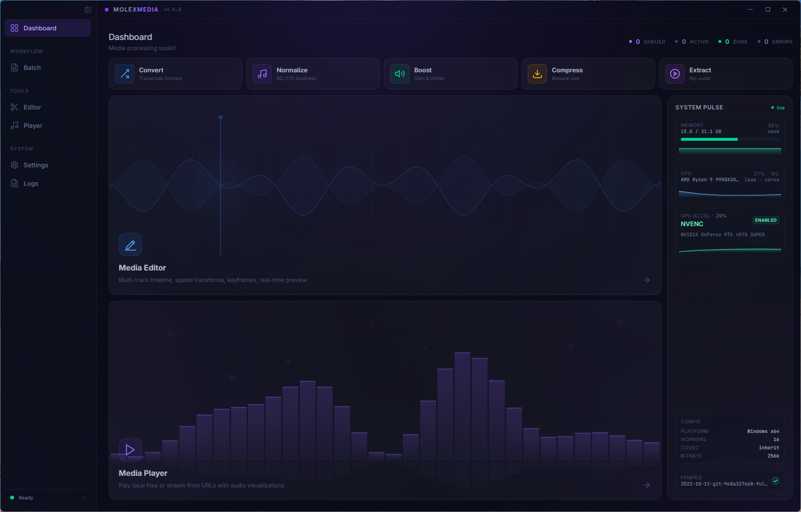
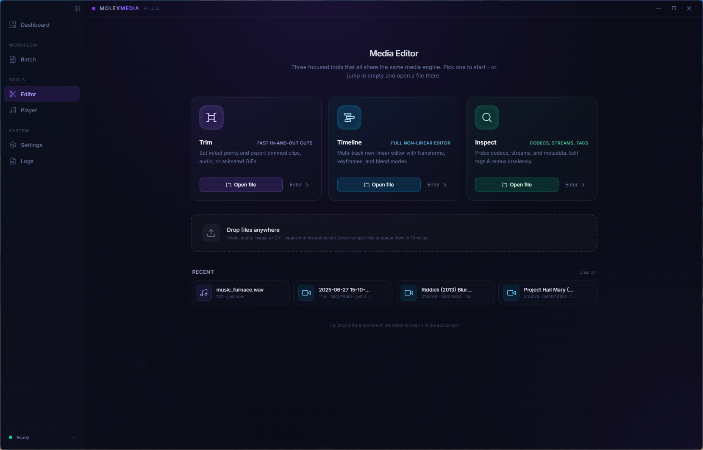
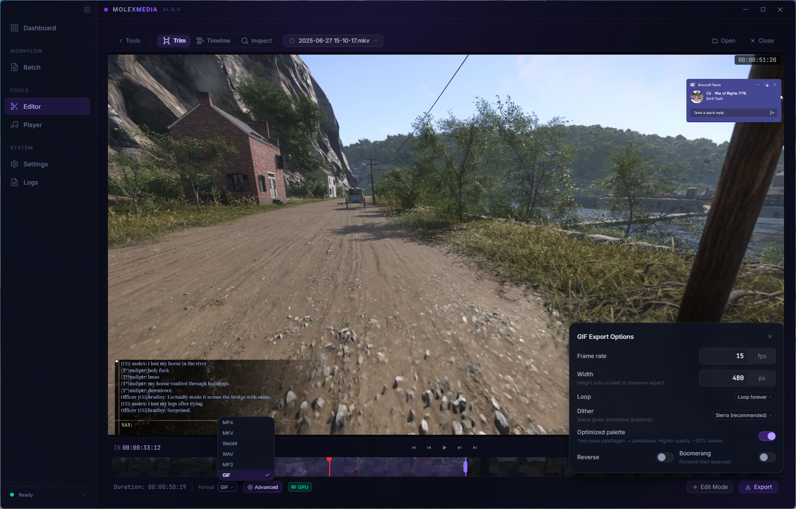
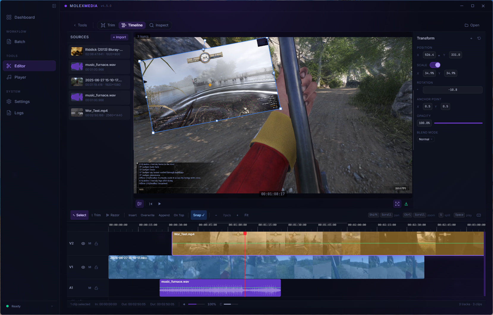
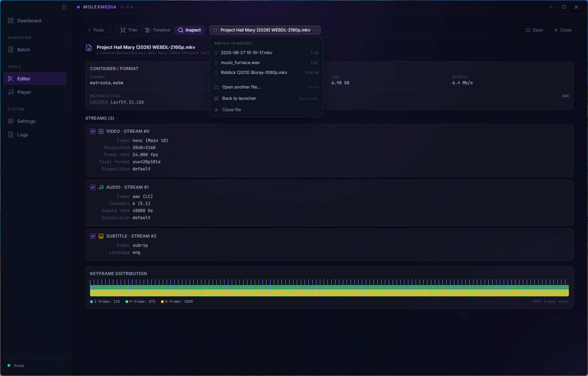
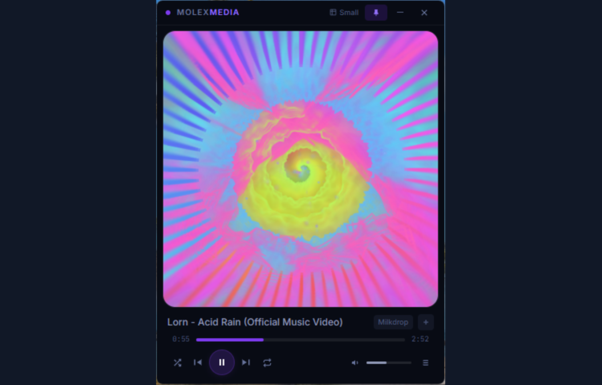

<div align="center">

<picture>
  <source media="(prefers-color-scheme: dark)" srcset=".github/assets/logo.svg">
  <source media="(prefers-color-scheme: light)" srcset=".github/assets/logo.svg">
  
</picture>

<br/>

**Cross-platform media processing toolkit powered by FFmpeg**

[](https://github.com/tonywied17/molex-media-electron/actions/workflows/ci.yml)
[](https://github.com/tonywied17/molex-media-electron/actions/workflows/build.yml)
<a href="https://github.com/tonywied17/molex-media-electron/releases"></a>
<a href="LICENSE"></a>
<a href="https://github.com/tonywied17/molex-media-electron/releases"></a>

<br/>

[Download](#install) · [Features](#features) · [Quick Start](#quick-start) · [Contributing](#contributing) · [Report a Bug](https://github.com/tonywied17/molex-media-electron/issues/new?template=bug_report.yml) · [Request a Feature](https://github.com/tonywied17/molex-media-electron/issues/new?template=feature_request.yml)

<br/>



<br/>

<table>
  <tr>
    <td align="center"><a href=".github/assets/sections/batch-processor.png"><br/><sub>Batch Processor</sub></a></td>
    <td align="center"><a href=".github/assets/sections/media-editor-tools.png"><br/><sub>Media Editor Tools</sub></a></td>
    <td align="center"><a href=".github/assets/sections/clip-video.png"><br/><sub>Clip Video</sub></a></td>
    <td align="center"><a href=".github/assets/sections/timeline-editor.png"><br/><sub>Timeline Editor</sub></a></td>
    <td align="center"><a href=".github/assets/sections/media-inspector.png"><br/><sub>Media Inspector</sub></a></td>
  </tr>
  <tr>
    <td align="center"><a href=".github/assets/sections/media-player.png"><br/><sub>Media Player</sub></a></td>
    <td align="center"><a href=".github/assets/sections/media-player-popout-v2.png"><br/><sub>Player Popout</sub></a></td>
    <td align="center"><a href=".github/assets/sections/log-viewer.png"><br/><sub>Log Viewer</sub></a></td>
    <td align="center"><a href=".github/assets/sections/app-settings.png"><br/><sub>App Settings</sub></a></td>
  </tr>
</table>

</div>

---

## Features

### Batch Processing

- **Loudness Normalization** — ITU-R BS.1770-4 two-pass analysis with configurable Integrated Loudness (LUFS), True Peak (dBFS), and Loudness Range (LU)
- **5 Normalization Presets** — Defaults, Dialogue, Music, Broadcast, and Cinema — each with tuned I/TP/LRA targets; Advanced mode exposes manual sliders for fine-grained control
- **Volume Boost / Reduce** — Percentage-based amplifier applied to all audio streams; preserves channel layout and sample rate
- **Format Conversion** — Configurable video codec, audio codec, bitrate, resolution, and framerate; stream-copy or full re-encode modes
- **24 Conversion Presets** — General (MP4 H.264, MKV HEVC, WebM VP9, MP3 320k, FLAC), Web/Social (Discord 25 MB, YouTube, TikTok, Twitter/X, 720p Web), Devices (Apple, Android, Chromecast), Production (AV1, ProRes, FFV1, 4K Archive, MPEG-2), and Audio Only (WAV 16/24-bit, ALAC, M4A AAC, Opus, AC3 Surround) — with codec/container conflict detection
- **Media Extraction** — Five extraction modes (audio, silent video, animated GIF, still frames, embedded subtitles) with **17 curated presets** covering common rip-and-repurpose jobs; audio → MP3/AAC/FLAC/WAV/OGG/Opus/M4A with bitrate/sample-rate/channel overrides; silent video → fast stream-copy or H.264 re-encode; GIF → two-pass palettegen/paletteuse with configurable width, fps, dither, loop; frames → PNG/JPG/WebP at interval, fps, even-spaced count, or scene-change detection; subtitles → SRT/VTT/ASS sidecar files
- **Video & Audio Compression** — CRF-based encoding with 5 encoders (H.264, H.265/HEVC, VP9, AV1 SVT, AV1 aom), 4 quality presets (lossless / high / medium / low) plus custom CRF slider, per-codec speed presets (veryslow → veryfast), and optional target-size bitrate limiting with two-pass mode; **12+ delivery presets** (Web 1080p/720p, Mobile, Discord 25 MB, YouTube Master, Archive Master, AV1 Streaming, Film Grain, Animation, Audio Lossless FLAC, Audio High AAC, etc.); audio-only files compress to AAC, Opus, or FLAC
- **Per-file Operations** — Each file in the queue can have a different operation and options; mixed-operation batches process in a single run
- **Concurrent Workers** — Configurable worker pool with mid-batch pause, resume, and cancellation
- **Real-time Progress** — Per-task speed, ETA, and progress bar with desktop notifications on completion
- **35+ Formats** — 21 video extensions (MP4, MKV, AVI, MOV, WebM, TS…) and 14 audio extensions (MP3, WAV, FLAC, OGG, M4A, AAC, Opus…)
- **Subtitle & Metadata Preservation** — Optionally copy subtitle streams, tags, chapters, and metadata to output
- **Input Validation** — File existence checks, operation validation, boost range clamping, and zero-byte output detection with automatic cleanup

### Media Editor

- **NLE Timeline** — Multi-track non-linear editor with V1/A1 tracks, source bin, drag-to-timeline, and frame-accurate editing
- **7 Edit Types** — Insert, Overwrite, Replace, Ripple Overwrite, Place on Top, Append, and Fit to Fill
- **4 Trim Types** — Roll, Ripple, Slip, and Slide with context-sensitive cursor near edit points
- **Trim & Cut** — In/out point editing with two modes: fast (stream-copy, keyframe-aligned) or precise (re-encode, frame-accurate)
- **Split Clip** — Split at playhead position, split at in/out selection boundaries, or clip-to-selection to trim a clip down to the selected region
- **Merge / Concatenate** — Combine 2+ trimmed segments into a single file via FFmpeg concat demuxer (fast) or filter_complex (precise)
- **Spatial Compositing** — Per-clip transforms with position (X/Y), scale (uniform lock), rotation, anchor point, and opacity; interactive canvas preview composites all video layers in real time
- **Transform Gizmos** — Drag-to-move, corner/edge scale handles (Shift = uniform), rotation handle with 15° snap, and anchor adjustment — all with affine matrix hit-testing on rotated bounding boxes
- **Keyframe Animation** — Add/remove keyframes per transform property with 4 easing functions (linear, ease-in, ease-out, ease-in-out), angle shortest-path interpolation, and binary search keyframe lookup
- **8 Blend Modes** — Normal, Multiply, Screen, Overlay, Darken, Lighten, Add, and Difference — applied in both canvas preview and FFmpeg export
- **Transform Inspector** — Numeric inputs for all spatial properties with drag-to-scrub, keyframe toggle buttons (◆), uniform scale lock, and blend mode dropdown
- **Replace Audio Track (A2)** — Swap a video's audio with another file while preserving the video stream; inline trim handles on the A2 timeline track with per-track volume and mute controls; drag A2 between clips
- **GIF Export** — Two-pass palette generation for high-quality GIFs with configurable loop, FPS (1-30), and width
- **Remux** — Losslessly keep/drop individual streams, edit metadata tags, and set per-stream disposition flags (default, dub, original, comment, lyrics, karaoke, forced, hearing/visual impaired)
- **Stream Inspector** — Detailed FFprobe viewer with container info, per-stream codec/resolution/channels/sample rate, and metadata editor
- **Snap System** — Snap-to-edges during drag/trim operations with toggleable snap indicator
- **Undo / Redo** — 50-level history stack for all clip, trim, split, transform, and keyframe operations
- **Per-clip Controls** — Independent volume slider, mute toggle, speed adjustment, and spatial transform per clip
- **Playback Controls** — Volume slider, speed selector (0.25x-2x), and keyboard shortcuts (Space, I, O, R, arrows, J/K/L transport)
- **Drag-to-reorder** — Visual multi-clip track lane with proportional clip blocks, audio replacement badges, and drag-and-drop sequencing
- **Video & Waveform Preview** — Canvas 2D composited preview for multi-layer spatial transforms; native `<video>` for single-clip; canvas waveform for audio-only
- **FFmpeg Spatial Export** — Per-clip filter chains: scale → rotate → opacity → overlay positioning with animated keyframe expressions via `eval=frame`; blend mode support via FFmpeg blend filters
- **7 Output Formats** — Video: MP4, MKV, WebM, AVI, MOV, TS, GIF — Audio: MP3, WAV, FLAC, OGG, M4A, AAC, Opus

### Media Player

- **Local Playback** — Play audio and video files from your filesystem with full playlist management; seamless large file support (2 GiB+)
- **URL Streaming** — Resolve and stream audio from YouTube videos, playlists, and direct audio URLs via yt-dlp (auto-downloaded) with auto-retry on expired CDN tokens
- **8 Visualizations** — DMT, Space, Milkdrop, Plasma, Bars, Wave, Horizon, and Rain — all real-time canvas rendering via Web Audio API
- **Beat Detection** — Per-frame analysis across sub-bass, bass, low-mid, mid, high-mid, and treble bands with beat-reactive visuals
- **Audio Quality** — Best / Good / Low quality presets for YouTube stream selection
- **Playlist Features** — Drag-to-reorder, shuffle, repeat (off / all / one), now-playing indicator, auto-scroll to active track, folder browser with system shortcuts, auto-skip on consecutive failures
- **Transport Bar** — Custom seek bar with visual thumb and fill, play/pause, prev/next, shuffle, repeat, volume slider with mute toggle
- **Popout Player** — Always-on-top window with compact transport, pin/unpin, 3 size presets, custom size memory, state transfer, and auto-resume playback
- **URL Input & History** — Paste YouTube URLs or direct audio links; persisted history with title, track count, and date
- **Cookie Caching** — Transparent browser cookie export for authenticated YouTube content with auto-retry on auth failures

### App & UI

- **Zero Setup** — FFmpeg and yt-dlp are downloaded automatically on first launch
- **Setup Wizard** — First-run flow: Welcome → Downloading → Complete → Error, with retry, progress bar, and manual-install fallback
- **Dashboard** — Quick stats (ready / processing / completed / errors), 5 workflow launchers, tool cards with animated canvas backgrounds, system info, and recent activity feed
- **System Tray** — Icon with context menu (Show, Pop Out Player, Player, Editor, Processor, Logs, Quit), live batch progress in tooltip, and minimize-to-tray behavior
- **Auto-updater** — Check / download / install from GitHub Releases with progress forwarding and persistent update status from startup
- **Live Processing Panel** — Sidebar-embedded task list with progress bars, pause/cancel controls
- **Log Viewer** — Filterable by level (info / warn / error / debug / success / ffmpeg), free-text search, auto-scroll, copy single entry or all filtered logs, open log directory
- **Drag-and-drop Everywhere** — Drop files onto batch queue, editor, player, or processing view

---

## Install

Grab the latest release for your platform:

| Platform | Download | Format |
|----------|----------|--------|
| **Windows** | [Latest Release](https://github.com/tonywied17/molex-media-electron/releases/latest) | `.exe` (NSIS installer) |
| **macOS** | [Latest Release](https://github.com/tonywied17/molex-media-electron/releases/latest) | `.dmg` (Intel & Apple Silicon) |
| **Linux** | [Latest Release](https://github.com/tonywied17/molex-media-electron/releases/latest) | `.AppImage` |

> FFmpeg and yt-dlp are downloaded automatically on first launch — no manual setup required.

---

## Quick Start

```bash
# Clone & install
git clone https://github.com/tonywied17/molex-media-electron.git
cd molex-media-electron
npm install

# Development (hot-reload)
npm run dev

# Run tests
npm test

# Build for production
npm run build

# Package for distribution
npm run package          # Current platform
npm run package:win      # Windows
npm run package:mac      # macOS
npm run package:linux    # Linux
```

---

## Tech Stack

- **Electron** — Cross-platform desktop framework
- **React 19** — UI with functional components and hooks
- **TypeScript** — Full type safety across main and renderer
- **Vite** — Build tooling via electron-vite
- **Tailwind CSS** — Utility-first styling
- **Zustand** — Lightweight state management
- **Framer Motion** — Animations and transitions
- **Lucide React** — Icon library
- **react-dropzone** — Drag-and-drop file handling
- **electron-store** — Persistent configuration
- **electron-builder** — Packaging & distribution
- **Vitest** — Unit and integration testing
- **yt-dlp** — YouTube audio streaming and playlist resolution
- **Web Audio API** — Real-time audio analysis and visualization

---

## Feedback & Issues

Found a bug or have an idea? We use GitHub Issue templates to keep things organized:

- [**Report a Bug**](https://github.com/tonywied17/molex-media-electron/issues/new?template=bug_report.yml) — Something isn't working as expected
- [**Request a Feature**](https://github.com/tonywied17/molex-media-electron/issues/new?template=feature_request.yml) — Suggest a new feature or enhancement
- [**Browse Open Issues**](https://github.com/tonywied17/molex-media-electron/issues) — See what's already been reported or upvote existing requests

Please search existing issues before opening a new one to avoid duplicates.

---

## Contributing

Contributions are welcome! See [CONTRIBUTING.md](CONTRIBUTING.md) for guidelines on branch naming, commit conventions, and the development workflow.

---

## License

[MIT](LICENSE) — build cool things with it.

---

<div align="center">
<sub>Built with Electron · React · Tailwind · Framer Motion · FFmpeg</sub>
</div>
